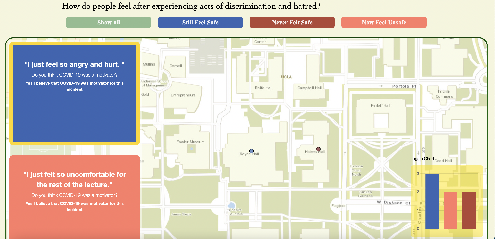

# Chinese-Discrimination
### By Steven Tran and Diana Tran
>Our map application is designed for Chinese students who attend UCLA and that have been discriminated against on campus to share their story to the community. The goal of this application is to let these students express their feelings and find a send of solidarity and community despite the events they have faced.

## Table of Contents
* [Objective](#objective)
* [Who is being empowered?](#who-is-being-empowered)
* [What technology was used?](#what-technology-was-used)
* [What technical and ethical problems could there be in developing this tool?](#What-technical-and-ethical-problems-could-there-be-in-developing-this-tool)
* [How it can be repurposed?](#how-can-it-be-repurposed)
* [The Mapplication](#the-mapplication)

## Objective
### What social problem is being addressed?
Chinese Americans have faced a long history of discrimination and hate in America.  Chinese discrimination rose when the pandemic started because there was a misconception that the Chinese community brought the virus to America. Through our project, we hope to address the hidden struggles that the Chinese community goes. We aim to do this by creating a mapplication that provides a platform for Chinese Americans to voice their frustrations about the discriminatin they face.

### Who is being empowered?
By creating a map of Chinese UCLA students who have been discriminated based off of data that is sourced from the community, we amplify their voices and experiences. Sometimes, data that is gathered from large government groups often misrepresent data. With Chinese members as the main contributers to our mapplication, we are more confident that our map reflects their experiences.

### What technology was used?
In this project we are utilizing opensource software such as Papaparse (parser for csv) and Leaflet (to create our map). In addition, we used HTML, CSS and javascript in order to create our webpage. 

### What technical and ethical problems could there be in developing this tool?
One ethical problem that we may encouter with developing this tool relates to privacy concerns. Some individuals may not want this information to be shared on a public platform. A technical problem that we may encounter is explaining gaps that may appear in our dataset. For example, some individuals may leave out certain information because they are not comfortable with it.

### How can it be repurposed?
Others can use this project in the future by accessing it through various ways such as a staff member from the Assosciation of Chinese Americans at UCLA sharing it to everyone in the club. Once they have access to the website itself, they can interact with our map and slideshow to read each individual's stories. Each story on the slideshow is connected to the points on the map which adds a narrative to the experience. The color design of the website reflects the user's expereince at UCLA. We hope through our design that users in the future will be able to visually see the experiences of others and be empowered to share their own story. In addition, the map that we have currently displays the stories shared by users as well as their perception of safety at UCLA. We hope that our map can be utilized by the DailyBruin in an article that highlights discrimination at UCLA. That way, other students who may not be Chinese can learn more about Chinese discrimination at UCLA. 

## The Mapplication
### Features
1. **Responsive Map**

The map corresponds directly with the scrollbar. As the users scroll to each story, the map will pan to the point that the user story refers to. The user can then click on the marker to read more about th experience.

2. **User Responses + Scrollbar**

The users are able to scroll through users responses in the scrollbar. The scrollbar will highlighted the card that the user is currently using.

3. **Bar Chart**

Located on the bottom right of the map, there is a bar chart visualizing the amount of responses that users chose when filling out the survey. The color of the bar graphs match the colors of the buttons and messages. If users do not want to see the bar graph, they can minimize it by clicking on the "toggle chart". To bring back the graph, users can click the same "toggle chart" and it will show back up. 

4. **Window Pop-Up**

Users entering the website will be greeted with an automatic pop-up welcoming the user and providing some information regarding the website. At the end of the description, users have the option of filling out the survey and then closing the pop-up window by clickng the "X" button to continue to the website, or declining to fill out the survey and click the "X" button to enter. 

5. **Colors**

The colors of the markers on the map, bar chart, and cards corespond to users response to the survey question "How has the incident changed your perception of safety at UCLA?". This helps connect all the applications on our map together.

### Screenshots

